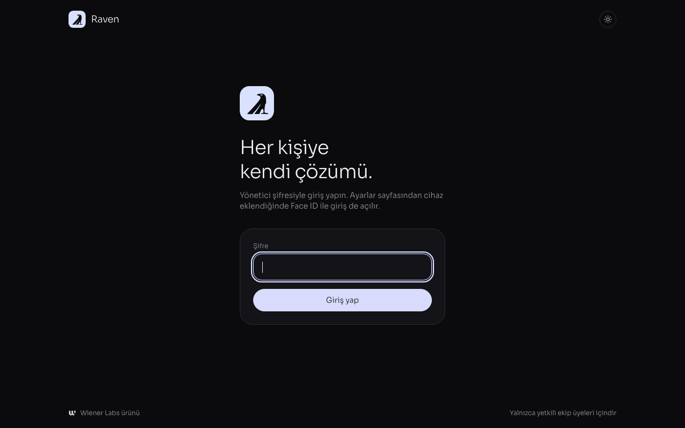
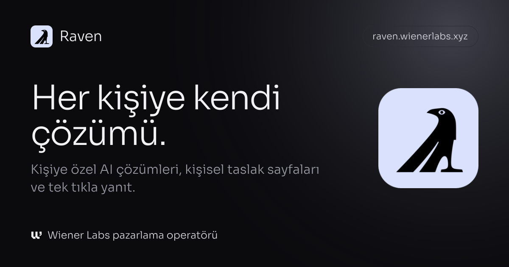
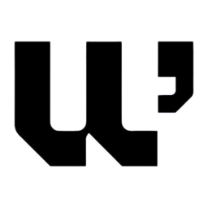

<p align="center">
  
</p>

<h1 align="center">Raven</h1>

<p align="center">
  One specific AI solution for every contact, delivered with care.<br>
  The marketing operator of <a href="https://wienerlabs.xyz">Wiener Labs</a>.
</p>

<p align="center">
  <a href="https://raven.wienerlabs.xyz/film/raven-film.mp4">Film</a> ·
  <a href="https://github.com/wienerlabs/raven/issues/17">Roadmap</a> ·
  <a href="#local-setup">Local setup</a> ·
  <a href="#whatsapp-setup">WhatsApp</a> ·
  <a href="#face-id-sign-in">Face ID</a> ·
  <a href="#credits-and-license">License</a>
</p>

<p align="center">
  <a href="https://raven.wienerlabs.xyz/film/raven-film.mp4">
    
  </a>
</p>

<p align="center">
  <a href="https://raven.wienerlabs.xyz/film/raven-film.mp4">Watch the 49 second film with sound</a> · 1080p, 60 fps
</p>

Raven is the personal outreach engine and marketing operator of Wiener Labs. It turns a contact list into one specific AI solution per person, then reaches every contact with a personal email (or a WhatsApp message when there is no email), a personal one page solution brief, one click replies and polite follow ups. Every step is paced, tracked and stoppable, and every answer lands in one inbox.

The product UI is Turkish. The visual language follows the Paralyx design system: Sora Light, lavender accent reserved for interactive elements, pill buttons and rounded cards. The admin panel and login open in a dark theme by default (a toggle switches to light and is remembered per browser); recipient facing pages and emails stay light and carry the Wiener Labs mark, while the panel carries the Raven mark.

## What it does

- **Import** Excel or CSV lists (Apollo style exports and Turkish headers are recognised). Duplicates merge by email or phone. Sanctioned country domains and consent jurisdictions are held automatically.
- **Research** each company from its email domain (homepage title, description, text excerpt) and check MX records before sending.
- **Personalise** with Claude: one solution per person (problem, three step system, capabilities, two week pilot, metrics, security note), an email with A/B subjects, two follow ups, a WhatsApp text and a landing page. A validator blocks em dashes, exclamation marks, emoji, spam words, raw links, crypto solutions, gendered honorifics and names that do not match the list.
- **Review** every pitch in the panel with live previews of all emails, the WhatsApp bubble and the landing page. Edit fields or the full JSON, send yourself a test, approve in bulk.
- **Launch once.** Raven spreads the sends across business hours with random gaps, per sender daily limits and sender rotation. Follow ups thread under the first email and stop as soon as the person replies, clicks a reply button, unsubscribes or bounces. A bounce guard pauses the campaign if the bounce rate climbs.
- **Get answers.** Each email carries one click reply buttons (meeting, send details, not now), a personal brief with a note form and calendar link, and IMAP sync that detects replies, auto replies and bounces in the sender mailbox. Every response lands in the inbox page and can notify the team by email or Slack.
- **WhatsApp both ways.** With a business number set, every email and personal brief offers "WhatsApp'tan yazın". The prefilled message carries a reference code, so a message from a new number shows up under the right contact as an unverified sender until someone on the team links the number; a reference code can never overwrite or impersonate a known number. Contacts without email get click to chat links with the personal text prefilled, or an approved Cloud API template when they opted in. Inside the 24 hour service window the team replies from the panel to the number that actually wrote.
- **One WhatsApp inbox.** Conversations open in a three pane inbox: a searchable thread list with waiting and unverified filters, the conversation with day separators and a live 24 hour window countdown, and the contact context (solution, links, notes). Replies go out through the Cloud API, or open in your own WhatsApp with the text prefilled and are logged back with one click. Saved replies fill in the name, company, solution, brief link and calendar link, and an AI draft grounded only in the contact's solution and the conversation is always reviewed before it goes anywhere. J and K move between chats, R replies, E marks a chat handled and / opens saved replies. The manual send queue has a focus mode that serves one message at a time (O opens, G marks sent, S skips).
- **Know what to do today.** The dashboard lists what needs attention right now: meeting requests, WhatsApp windows about to close, unread replies, unverified numbers, manual sends, pending reviews and legal holds, each one click away. Email replies get an AI draft that opens in your mail app, and ⌘K (Ctrl K) searches contacts and jumps anywhere in the panel.
- **See the response curve.** The dashboard charts cumulative replies, daily replies or the reply rate over 14, 30 or 90 days against daily sends, marks meeting requests, breaks replies down by intent and shows reply rates per sector. It refreshes itself every minute.
- **Sign in with Face ID.** Team members add a passkey from Settings or through a one time invite link and then sign in with Face ID, Touch ID or Windows Hello. Faces never leave the device; Raven only verifies the signature. Once everyone is set up, the admin password can be switched off so only invited people get in.
- **Brand everywhere.** Upload the email logo in Settings and it appears on every email, personal page and link preview. Links to the panel and invites unfurl with the Raven card, personal briefs with the Wiener Labs card.

## Roadmap

Raven is being built into a full marketing operations module and, later, a product for other teams. The plan lives in the pinned [roadmap issue](https://github.com/wienerlabs/raven/issues/17), grouped into three milestones: [Kampanyaya hazır](https://github.com/wienerlabs/raven/milestone/1) (what has to close before the first real campaign), [Pazarlama operatörü](https://github.com/wienerlabs/raven/milestone/2) (calendar, pipeline, sequences, AI replies, deliverability, reporting, content) and [Ürün](https://github.com/wienerlabs/raven/milestone/3) (workspaces, billing, onboarding, API, operations).

## Screens

<p align="center">
  
</p>

The panel opens in the dark theme; the recipient side (emails, personal briefs, unsubscribe and privacy pages) stays light and carries the Wiener Labs brand.

<p align="center">
  
</p>

Shared links to Raven unfurl with this card.

The film at the top walks through the whole flow: the contact list, one solution per person, the one click reply, the WhatsApp inbox with an AI draft and the Today panel. Every frame is rendered in code from the product's own fonts, colours and screens, captured in headless Chrome with motion blur and scored with synthesized sound. The people and companies in it are sample data.

## Stack

Next.js 16 (App Router, server actions, proxy), React 19, Tailwind CSS 4, Drizzle ORM on Postgres (PGlite for tests and local work), nodemailer and imapflow, the Anthropic SDK, Vitest.

```
contacts, settings -> research (website, MX) -> Claude -> validator -> pitch
approved pitches -> launch -> slot planner -> messages (scheduled)
cron, worker or panel -> dispatcher (SKIP LOCKED) -> SMTP, Resend or WhatsApp
recipient -> landing page, reply buttons, unsubscribe -> events, responses, suppressions
sender inbox -> IMAP sync -> replies, auto replies, bounces
```

## Local setup

```bash
npm install
cp .env.example .env.local
npm run db:migrate
npm run import:contacts -- "path/to/list.xlsx"
npm run generate
npm run build && npm start
```

`DATABASE_URL` accepts any Postgres URL or `pglite:./.data/raven` for a zero install local database. Without `EMAIL_PROVIDER=smtp` or `resend`, Raven runs in console mode and never sends real email. Pre generated pitch files keyed by email can be loaded with `npm run import:pitches -- file.json --approve-clean`.

## Sending setup

1. Use a dedicated sending domain or subdomain and add SPF, DKIM and DMARC records. The settings page checks all three and verifies the SMTP login.
2. With Google Workspace, enable two step verification on the sender mailbox and create an app password. SMTP is `smtp.gmail.com:465`, IMAP is `imap.gmail.com:993`.
3. Warm new mailboxes for two weeks at 20 to 40 emails a day, then raise `SENDER_DAILY_LIMIT` gradually. Several mailboxes can be listed as JSON in `RAVEN_SENDERS` and Raven rotates between them.
4. Send yourself tests from a contact page before launching. Links opened from test emails run in preview mode and never change a contact.

Resend's acceptable use policy forbids cold outreach, purchased lists and scraped data, so campaigns go through your own SMTP mailboxes. Raven uses Resend only for system email to the team: set `RESEND_API_KEY` and `RAVEN_NOTIFY_FROM` (for example `Raven <bildirim@raven.wienerlabs.xyz>` on a domain verified in Resend) and reply alerts go to the notification address in Settings without touching the outreach mailboxes. `EMAIL_PROVIDER=resend` still exists for audiences that opted in.

## Scheduling

The dispatcher sends whatever is due and is safe to run from several places at once (rows are claimed with `FOR UPDATE SKIP LOCKED`).

- **Vercel cron:** `vercel.json` runs `/api/cron/dispatch` once a day, which is all the Hobby plan allows. On Pro, change the schedule to `* * * * *`.
- **External scheduler:** call `GET /api/cron/dispatch` every minute with `Authorization: Bearer <CRON_SECRET>` (for example from cron-job.org). Add `?inbox=1` to force an inbox sync.
- **Worker:** `npm run worker` dispatches every 30 seconds and syncs inboxes every 5 minutes against the configured database.
- **Panel:** turn on live sending on the campaign page to dispatch from an open browser tab.

## WhatsApp setup

Everything is configured in the Kurulum tab of the WhatsApp page, which walks through the five steps below and shows what already works; environment variables are only a fallback. Only the business number is needed to start.

1. **Business number.** Enter the WhatsApp Business number people should write to. Emails and personal briefs immediately show a "WhatsApp'tan yazın" button that opens a chat with a prefilled message and a reference code such as `R-AbCdE12345`.
2. **Cloud API.** In Meta Business create a system user token with `whatsapp_business_messaging` and `whatsapp_business_management`, then paste the token, the phone number ID and the WhatsApp Business account ID. The token and the app secret are stored encrypted (AES-256-GCM, key derived from `RAVEN_SESSION_SECRET`) and are never sent back to the browser.
3. **Webhook.** Copy the callback URL (`/api/webhooks/whatsapp`) and the generated verify token into the Meta app, subscribe to `messages`, and save the app secret so every delivery is signature checked.
4. **Template.** "Şablonu Meta'ya gönder" submits the `raven_intro` marketing template in Turkish and English with a URL button pointing at `https://<your domain>/r/{{1}}`; "Şablon durumunu yenile" shows the review result.
5. **Automatic sending.** Once the template is approved, turn on automatic sending. Templates only go to contacts with WhatsApp consent; everyone else stays in the one tap manual queue.

Inbound messages are classified like email replies. A message from an unknown number that quotes a reference code is shown as an unverified sender and does not change the contact until the team links the number. `DUR` or `STOP` suppresses the number that wrote, and a unique index makes sure each Meta delivery is processed only once.

## Face ID sign in

Passkeys use WebAuthn with the relying party set to the host of `RAVEN_BASE_URL`, so they only work on the production domain (and on `localhost` during development). Face ID alone does not open the panel: only devices that were added from Settings by a signed in admin, or through a one time invite link created for a named person, are accepted. Challenges are single use and expire after five minutes, invites are single use and expire after 48 hours, and removing a person from Settings ends their open sessions.

Once every team member has a device, "Yalnızca Face ID ile girilsin" turns the admin password off, so only those people can sign in. The switch is only available to someone who signed in with Face ID, the password comes back automatically if no passkey is left, and `RAVEN_PASSWORD_LOGIN=force` reopens it in an emergency.

## Email logo and link previews

Settings has an email logo card. Upload a PNG or JPG (up to 512 KB, at least 40 px tall, 56 px or more recommended). Raven checks the real file signature, stores the image in the database and serves it from `/api/brand/logo/<hash>` with long lived caching, so every email and personal page shows it at a fixed 28 px height with explicit dimensions. SVG and WebP are refused because Gmail and Outlook do not display them. Without an upload the Wiener Labs mark is used. The same logo heads the Open Graph image of every personal brief, and the panel, sign in and invite links share the Raven card from `src/app/opengraph-image.tsx`.

## Compliance defaults

Every email names the sender and company, states why the reader received it and where the data came from, links the KVKK notice at `/gizlilik`, and offers a one click unsubscribe (`List-Unsubscribe` and `List-Unsubscribe-Post` per RFC 8058). Suppressions cover email, phone and domain and are checked before every send. Contacts flagged for sanctions or consent review stay on hold until an admin records the review. Before large campaigns in Türkiye, confirm your İYS obligations for commercial electronic messages.

## Scripts

| Command | Purpose |
| --- | --- |
| `npm run db:migrate` | Apply migrations to `DATABASE_URL` |
| `npm run import:contacts -- file.xlsx` | Import a list |
| `npm run import:pitches -- file.json [--approve-clean]` | Load pitch JSON keyed by email |
| `npm run pitches:validate -- pitches.json contacts.json` | Validate pitch files |
| `npm run generate [-- --limit=20]` | Generate missing pitches with Claude |
| `npm run worker` | Long running dispatcher and inbox sync |
| `npm test` | Unit and integration tests on PGlite |
| `TEST_DATABASE_URL=postgres://... npm test` | Run the database tests on a real Postgres server |
| `ANTHROPIC_API_KEY=... npm run test:live` | Draft real replies for eight scenarios (meeting, details, decline, English, prompt injection, email layout) and check the house rules; set `RAVEN_LIVE_OUT=drafts.md` to read the drafts |

## Environment

See `.env.example`. SMTP and IMAP passwords, the Anthropic key, the admin password, the session secret and the cron secret live in the environment. WhatsApp credentials can be entered in the panel, where they are stored encrypted. Non secret settings (sender profile, offer text, calendar link, legal details) are edited in the panel.

## Credits and license

<p>
  <a href="https://wienerlabs.xyz">
    <picture>
      <source media="(prefers-color-scheme: dark)" srcset="public/brand/wiener-mark-white.png">
      
    </picture>
  </a>
</p>

Built by [Wiener Labs](https://wienerlabs.xyz), led by Baturalp Güvenç.

Copyright © 2026 Wiener Labs. All rights reserved. The source is public so it can be read and reviewed; it is not licensed for reuse or redistribution.
